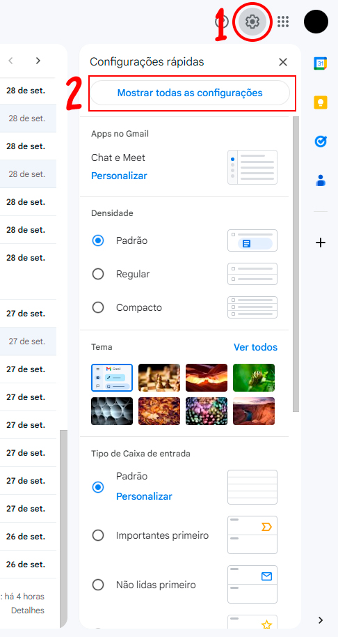
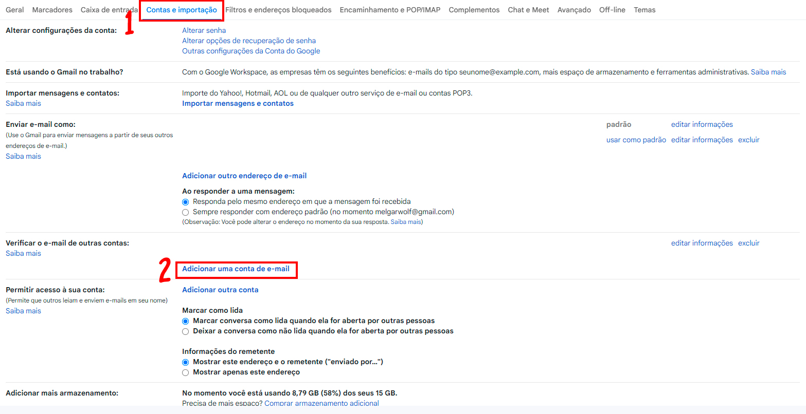
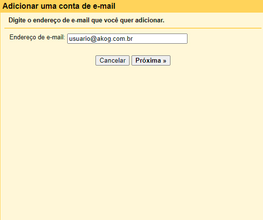
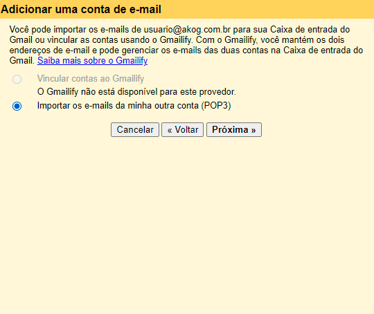
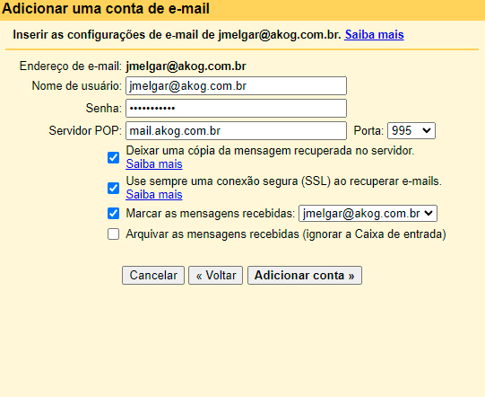
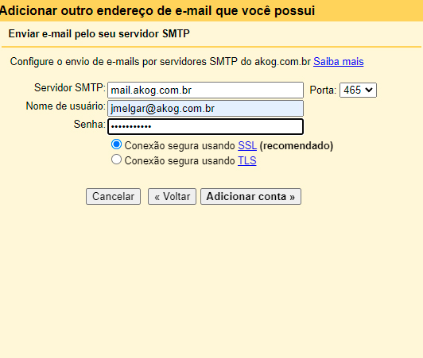

# config-gmail
Para configurar seu e-mail @akog.com.br no Gmail usando POP ou IMAP, você precisará seguir algumas etapas para sincronizar corretamente as contas. Abaixo, apresento o tutorial com texto e as imagens que você precisará para cada etapa:

### **Passo 1: Acesse as configurações do Gmail**
1. **Abra o Gmail** no seu navegador.
2. No canto superior direito, clique no **ícone de engrenagem** para abrir o menu de configurações.
3. Clique em **"Mostrar todas as configurações"**.

*Imagem de referência:*  
  
[Imagem de exemplo da tela de configurações no Gmail]

---

### **Passo 2: Vá para a aba "Contas e Importação"**
1. Dentro das configurações, selecione a aba **"Contas e Importação"**.
2. Role para baixo até a seção **"Verificar e-mails de outras contas"** e clique em **"Adicionar uma conta de e-mail"**.

*Imagem de referência:*  
  
[Imagem de exemplo mostrando a seção onde você adiciona uma conta de e-mail]

---

### **Passo 3: Adicione o endereço de e-mail**
1. Uma janela pop-up será aberta. Insira seu endereço de e-mail completo, por exemplo, **usuario@akog.com.br**, e clique em **Próxima**.
   
*Imagem de referência:*  
  
[Imagem de exemplo onde você insere o e-mail completo]

---

### **Passo 4: Escolha entre POP ou IMAP**
1. Escolha **"Importar e-mails da minha outra conta (POP3)"** para configurar via POP.
2. Caso prefira IMAP (sincronização completa de e-mails), configure o **encaminhamento** do e-mail.

*Imagem de referência:*  
  
[Imagem mostrando a tela onde você escolhe entre POP ou IMAP]

---

### **Passo 5: Configure o servidor de recebimento (IMAP ou POP)**
1. **Servidor IMAP (recomendado para sincronização completa)**:
    - Servidor: **mail.akog.com.br**
    - Porta: **993**
    - Tipo de conexão: **SSL**
   
2. **Servidor POP**:
    - Servidor: **mail.akog.com.br**
    - Porta: **995**
    - Tipo de conexão: **SSL**
   
3. Insira seu nome de usuário e senha de e-mail conforme solicitado.

*Imagem de referência:*  
  
[Imagem de exemplo onde você preenche os dados do servidor de recebimento]

4. Marque "Sim, quero poder enviar e-mails... " e continue para próxima etapa.

---

### **Passo 6: Configuração do servidor de envio (SMTP)**
1. Em seguida, configure o servidor SMTP para o envio de e-mails:
    - Servidor: **mail.akog.com.br**
    - Porta: **465**
    - Tipo de conexão: **SSL**
   
2. Insira seu nome de usuário e senha novamente.

*Imagem de referência:*  
  
[Imagem de exemplo onde você configura o servidor de envio]

---

### **Passo 7: Conclusão e verificação**
1. Após preencher as informações, clique em **"Adicionar conta"**.
2. O Gmail pode solicitar uma verificação de sua conta. Você receberá um e-mail com um código de confirmação, que precisará inserir para concluir o processo.

---

### **Passo 8: Teste a configuração**
1. Envie um e-mail de teste para verificar se o envio e recebimento estão funcionando corretamente.

---